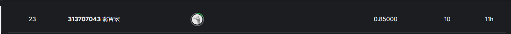

# 智能所-Machine Learning Lab4-中文文本理解 LLM語言模型
## Author：國立陽明交通大學 資訊管理與財務金融學系財務金融所碩一 313707043 翁智宏

本次是本學期機器學習最後一次作業，要訓練/微調出一個能夠閱讀中文文本並且給予特定格式答案的語言模型，

**Questions**
Given the advancements in Large Language Models, what level of improvement can we anticipate in computer reading comprehension capabilities for Traditional Chinese?

**Objective**
Computer Traditional Chinese Reading Comprehension Test (Multiple Choice): Aim to train a large language model to comprehend articles written in Traditional Chinese and respond accurately to associated questions.

**Example**
尹雪艷非常迷人，名氣大了，難免招忌。一些同行的姊妹看了眼紅，就到處放話：尹雪艷的八字帶著重煞，犯了白虎，沾上的人，輕者敗家，重者人亡。但是這一點反而增加了她的神秘感，讓她名氣更響亮。請問根據此段文章，下面哪一個選項與「尹雪艷八字犯重煞」無關？ 1. 增加尹雪艷神秘感, 2. 同行因忌妒而放話, 3. 會讓親近者家敗人亡, 4. 忠孝仁愛信義和平

我們採用 **LlaMA2** 作為模型基礎，然後使用專門用於中文領域的Chinese-lora-7B，進行文本的閱讀。

Kaggle Competition：[點擊這裡](https://www.kaggle.com/competitions/zh-tw-reading-comprehension-test-for-ll-ms) 競賽連結

最終成績如下所示：



> 準確率在 0.85000 左右 (越高越精確)
---

## Dataset Description

**Training Set**

AI.xlsx

**Test Set**

AI1000.xlsx

**Sample Submission File**

Kaggle-sample.csv

## 模型介紹
使用了三種模型去實作出此題目的功能。

1.Chinese-lora-plus-7b(以下拿這做範例)
[請先下載Base Model](https://github.com/ymcui/Chinese-LLaMA-Alpaca)

2.Chinese-lora-pro-13b

3.ChatGLM

## 安裝依賴
請使用以下指令安裝本專案所需的依賴套件：

```bash
!pip install pandas openpyxl
!pip install bitsandbytes==0.38.1
!pip install torch transformers==4.31.0 peft==0.4.0 sentencepiece bitsandbytes accelerate
```
---

## 實作 (這邊介紹 Chinese-lora-plus-7b 為例)
### 第一步：資料預處理
#### 1. 將 Datasets 轉成 LoRA 的訓練的格式
```python
# xlsx_to_json.py
import pandas as pd
import json

def xlsx_to_json(xlsx_path, json_path):
    df = pd.read_excel(xlsx_path)

    data_list = []
    for idx, row in df.iterrows():
        article = str(row["文章"]).strip()
        question = str(row["問題"]).strip()
        option1 = str(row["選項1"]).strip()
        option2 = str(row["選項2"]).strip()
        option3 = str(row["選項3"]).strip()
        option4 = str(row["選項4"]).strip()
        correct_ans = str(row["正確答案"]).strip()  # 假設是 "1" "2" "3" "4"

        # 組成 input 區塊
        combined_input = (
            f"【文章】{article}\n"
            f"【問題】{question}\n"
            f"【選項】\n"
            f"1) {option1}\n"
            f"2) {option2}\n"
            f"3) {option3}\n"
            f"4) {option4}"
        )

        # 建立一筆 dict
        one_sample = {
            "instruction": "請仔細閱讀以下文章，理解內容後，依據邏輯分析，逐步排除錯誤選項，並最終選擇最正確的答案。只需要回覆正確的數字選項 (1, 2, 3, 或 4)。",
            "input": combined_input,
            "output": correct_ans
        }
        data_list.append(one_sample)

    # 寫入 JSON
    with open(json_path, "w", encoding="utf-8") as f:
        json.dump(data_list, f, ensure_ascii=False, indent=2)

if __name__ == "__main__":
    xlsx_path = "AI.xlsx"   # 你的原始資料
    json_path = "train.json"
    xlsx_to_json(xlsx_path, json_path)
    print(f"已將 {xlsx_path} 轉換為 {json_path}")
```

### 第二步：模型微調/訓練
#### 1. 模型訓練
```python
# finetune_lora.py
import os
import json
import torch
import gc
from datasets import Dataset
from transformers import (
    LlamaForCausalLM,
    LlamaTokenizer,
    TrainingArguments,
    Trainer,
    DataCollatorForSeq2Seq
)
from peft import LoraConfig, get_peft_model

# --------------- A) 超參數 ---------------
BATCH_SIZE = 2
EPOCHS = 5
LR = 5e-5
MAX_LENGTH = 1024
OUTPUT_DIR = "lora-out"

# --------------- B) 讀取 JSON 資料 ---------------
def load_data(json_path):
    with open(json_path, "r", encoding="utf-8") as f:
        data = json.load(f)
    return data


def format_example(example):
    """
    - instruction: str
    - input: str (可能是空)
    - output: str (模型要學習產生的回答)
    回傳 prompt, output_text
    """
    instruction = example["instruction"]
    input_text = example.get("input", "")
    output_text = example["output"]

    if input_text.strip():
        prompt = f"""請仔細閱讀以下文章，理解內容後，學習其中的邏輯，逐步排除選項，並最終選擇最正確的答案。只需要回覆正確的數字選項 (1, 2, 3, 或 4)。
        
        ### 指令:
        {instruction}

        ### 內容:
        {input_text}

        ### 最終答案:
        """
    else:
        prompt = f"""下面是描述任務的指令。編寫適當完成請求的回應。

        ### 指令:
        {instruction}

        ### 最終答案:"""

    return prompt, output_text

def tokenize_fn(example):
    prompt, answer = format_example(example)
    full_text = prompt + answer

    tokenized_prompt = tokenizer(prompt, truncation=False, return_tensors="pt")["input_ids"]
    tokenized_answer = tokenizer(answer, truncation=False, return_tensors="pt")["input_ids"]
    dynamic_max_length = min(MAX_LENGTH, len(tokenized_prompt[0]) + len(tokenized_answer[0]) + 10)

    encoding = tokenizer(
        full_text,
        max_length=dynamic_max_length,  
        truncation=True,
        padding="max_length",           # 使用填充
    )

    prompt_len = len(tokenized_prompt[0])
    labels = encoding["input_ids"].copy()
    labels[:prompt_len] = [-100] * prompt_len
    # print(f"有效 labels 数量: {sum(1 for label in labels if label != -100)}")
    
    return {"input_ids": encoding["input_ids"], "labels": labels}


# --------------- C) 載入 base model (Alpaca) ---------------
base_model_name = "shibing624/chinese-alpaca-plus-7b-hf"
tokenizer = LlamaTokenizer.from_pretrained(base_model_name)

tokenizer.add_special_tokens({"pad_token": "[PAD]"})
# 設定 tokenizer 的 pad_token_id
tokenizer.pad_token_id = tokenizer.convert_tokens_to_ids("[PAD]")

model = LlamaForCausalLM.from_pretrained(
    base_model_name,
    load_in_8bit=True,    # 利用 8-bit 量化, 節省顯存
    device_map="auto",    # 自動分配 GPU
)

# --------------- D) 設定 LoRA ---------------
lora_config = LoraConfig(
    r=8,
    lora_alpha=32,
    target_modules=["q_proj", "v_proj"], 
    lora_dropout=0.05,
    bias="none",
    task_type="CAUSAL_LM",
)

model.resize_token_embeddings(len(tokenizer))
model = get_peft_model(model, lora_config)

# --------------- E) 準備 Dataset ---------------
train_data_list = load_data("train.json")
train_dataset = Dataset.from_list(train_data_list)
train_dataset = train_dataset.map(tokenize_fn)

# 如果有驗證集 (valid_data.json)，可同理做 valid_dataset
# valid_data_list = load_data("valid_data.json")
# valid_dataset = Dataset.from_list(valid_data_list).map(tokenize_fn)

# --------------- F) 設定 TrainingArguments ---------------
training_args = TrainingArguments(
    output_dir=OUTPUT_DIR,
    per_device_train_batch_size=1,    
    gradient_accumulation_steps=32,     
    num_train_epochs=EPOCHS,
    learning_rate=LR,
    bf16=True,
    logging_steps=20,
    save_steps=3000,
    save_total_limit=1,
    disable_tqdm=False,                 # 顯示tqdm
    logging_strategy="steps",           # 每steps都log
    report_to=[],                       # 不用wandb
)

# --------------- G) 建立 Trainer 並微調 ---------------
data_collator = DataCollatorForSeq2Seq(
    tokenizer=tokenizer,
    model=model,
    padding=True,  
    pad_to_multiple_of=8,  
)

trainer = Trainer(
    model=model,
    args=training_args,
    train_dataset=train_dataset,
    data_collator=data_collator,  
)

for step, _ in enumerate(trainer.get_train_dataloader()):
    if step % 100 == 0:  # 定期清理缓存
        torch.cuda.empty_cache()
        gc.collect()

trainer.train()
trainer.save_model(OUTPUT_DIR)
print("LoRA fine-tune is done! The adapter is saved at:", OUTPUT_DIR)
```

### 第三步：模型推理
#### 1. 模型推理階段
```python
import pandas as pd
import csv
import torch
import re
from transformers import LlamaTokenizer, LlamaForCausalLM, GenerationConfig
from peft import PeftModel

# ---------------------------
# 1) 載入 微調後的模型 (base + LoRA)
# ---------------------------
base_model_name = "shibing624/chinese-alpaca-plus-7b-hf"
lora_weights = "lora-out"  

tokenizer = LlamaTokenizer.from_pretrained(base_model_name)
base_model = LlamaForCausalLM.from_pretrained(
    base_model_name,
    load_in_8bit=True,  
    device_map="auto",
)
model = PeftModel.from_pretrained(base_model, lora_weights, device_map="auto")
model.eval()

def generate_prompt(instruction, input_text=""):
    return f"""請仔細閱讀以下文章，理解內容後，逐步排除選項，注意有些會有否定語句要思考仔細意思，並最終選擇最正確的答案。只需要回覆正確的數字選項 (1, 2, 3, 或 4)。

            ### Instruction:
            {instruction}

            ### Input:
            {input_text}

            ### Response:"""

def ask(instruction, input_text="", max_new_tokens=16):
    prompt = generate_prompt(instruction, input_text)
    inputs = tokenizer(prompt, return_tensors="pt").to(model.device)

    gen_config = GenerationConfig(
        temperature=0.8,  # 提高隨機性
        top_p=0.85,       # 降低累積概率閾值，生成更多多樣答案
        num_beams=3,      # 使用多束搜索
        max_new_tokens=max_new_tokens,
    )
    
    with torch.no_grad():
        output_ids = model.generate(**inputs, generation_config=gen_config)

    output = tokenizer.decode(output_ids[0], skip_special_tokens=True)
    raw_answer = output.split("### Response:")[-1].strip()

    numbers = re.findall(r"[1234]", raw_answer)

    if numbers:
        final_answer = numbers[0]
    else:
        final_answer = "na" 

    return final_answer

# ---------------------------
# 2) 讀取測試集，進行推理
# ---------------------------
if __name__ == "__main__":
    df = pd.read_excel("AI1000.xlsx") 

    results = []

    for idx, row in df.iterrows():
        q_id = row["題號"] 
        article = str(row["文章"]).strip()
        question = str(row["問題"]).strip()
        option1 = str(row["選項1"]).strip()
        option2 = str(row["選項2"]).strip()
        option3 = str(row["選項3"]).strip()
        option4 = str(row["選項4"]).strip()

        # 組合成 input_text
        # 你可以自行修改內容格式，只要跟模型溝通清楚即可
        input_text = (
            f"【文章】{article}\n"
            f"【問題】{question}\n"
            f"【選項】\n1) {option1}\n2) {option2}\n3) {option3}\n4) {option4}"
        )

        instruction = (
            "請仔細閱讀以下文章和問題，並比較每個選項的內容。"
            "根據文章中的資訊，仔細想一想前後語句的邏輯，逐一排除不符合邏輯的選項，最後選擇最符合條件最高度正確的正確答案（1、2、3 或 4）。"
            "請按照以下步驟進行：1. 閱讀文章，理解核心內容。2. 分析問題的含義，逐一比較選項。3. 排除不符合條件的選項。4. 清晰地給出 \"最終答案：\"。"
            "有些題目會有雙重否定或是中文的語句差異，要注意這些小細節！"
            "請注意，只允許輸出一個數字答案，並避免任何解釋或多餘的字符。"
        )

        # 取得模型回答
        answers = [ask(instruction, input_text, max_new_tokens=16) for _ in range(10)]
        final_answer = max(set(answers), key=answers.count)  # 投票選出最多的答案

        print(f"ID={q_id}, Answer={final_answer}")
        results.append([q_id, final_answer])

    # ---------------------------
    # 3) 寫入 CSV 檔
    # ---------------------------
    with open("Kaggle-sample.csv", "w", newline="", encoding="utf-8") as fw:
        writer = csv.writer(fw)
        writer.writerow(["ID", "Answer"])
        writer.writerows(results)

    print("推理完成，答案已寫入 Kaggle-sample.csv")
```
